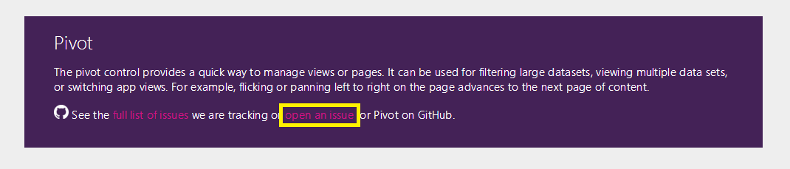
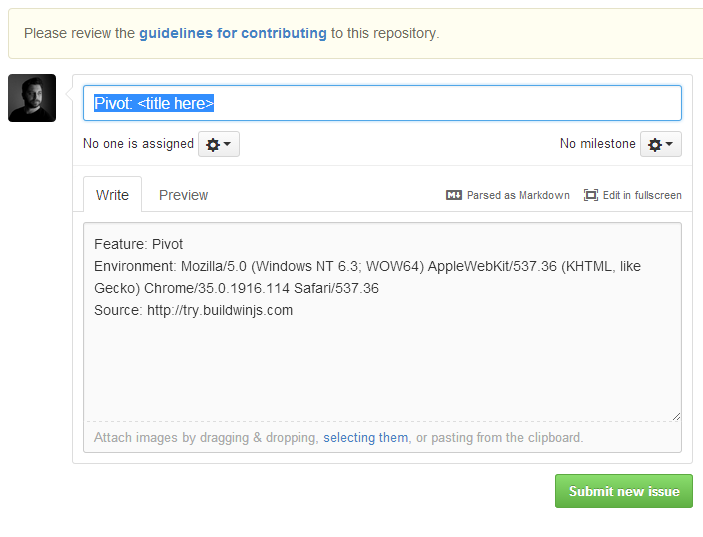
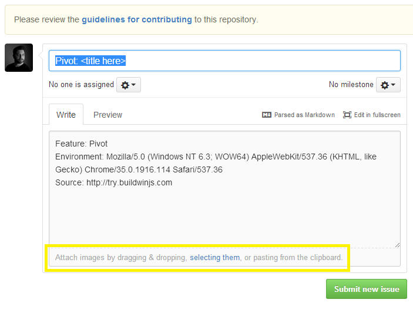
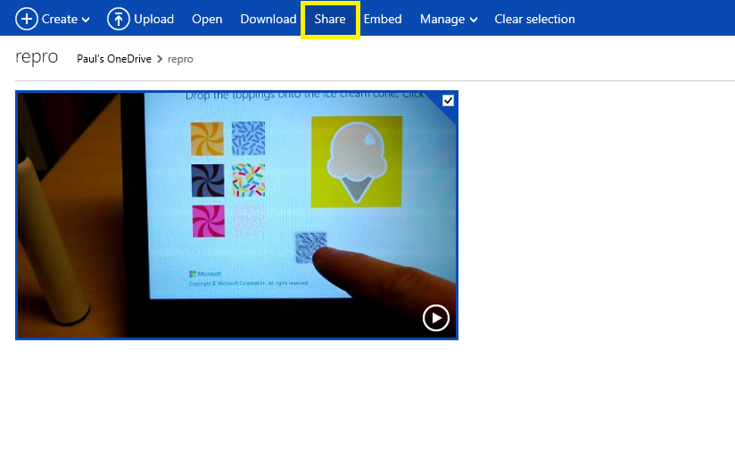
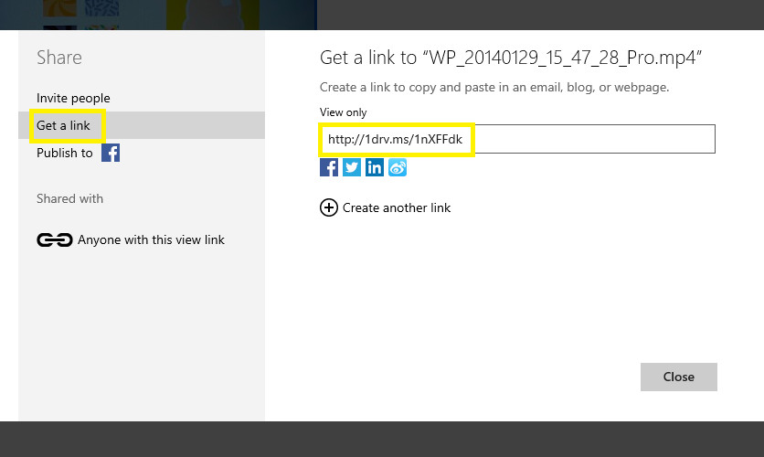
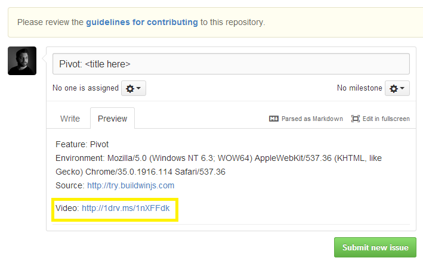

This page describes the light weight process on how to share repos of issues found with WinJS. The more context provided in the issue, the easier it is for the team to understand and make traction on addressing it. Items that would be helpful to include when submitting a new issue:
* Code snippets or code examples of the issue found
* Screenshots of issues
* Video of the sequence of events leading up to and including the issue
* Environmental information including the platform (Windows, Mac, iOS, Android, etc.) and browser (IE, Chrome, Firefox, etc.) versions where the issue occurred

This type of information is not required, but is appreciated as it brings more context and clarity to the issue.

## Share Environment Information
If the issue was found in one of our well known features here's a super quick way to share:

1. In the browser where the issue occured, navigate to `http://try.buildwinjs.com/#{component name}`, e.g. [http://try.buildwinjs.com/#pivot](http://try.buildwinjs.com/#pivot)
2. At the top of the component page, click on the `open an issue` link at the top of the page.

This will open a new issue against our repo populated with environment information


## Sharing Images and Code Snippets
GitHub natively supports attaching images to issues. You can drag and drop, upload, or copy/paste from the clipboard any images of the issue you have.



GitHub natively supports Markdown. So feel free to send us code snippets by using:

\`\`\`js

var my = new JavaScript.Code();

\`\`\`

And GitHub will render it accordingly:
```js
var my = new JavaScript.Code();
```

## Sharing Videos and full Code Samples
Unfortunately, there is not an easy way to include videos or larger code samples to issues in GitHub. In order to do so we ask you to do the following:

1. Upload the attachment to your preferred cloud storage service e.g. OneDrive, GDrive, DropBox, etc. (We'll use OneDrive as an example).
2. Share out a link to the location of the attachment


3. Include a link to the attachment in the new issue


 
