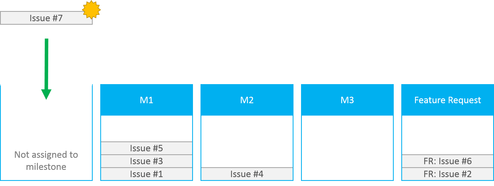
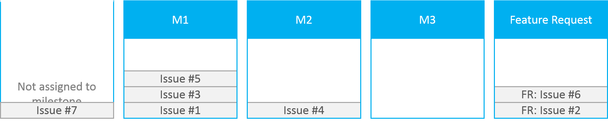
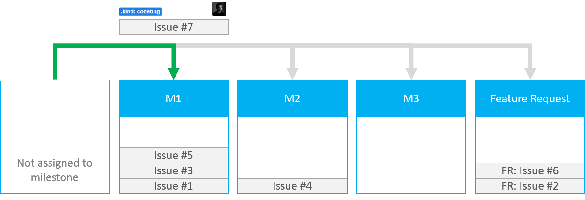
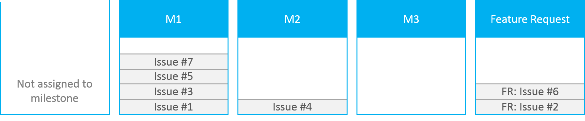
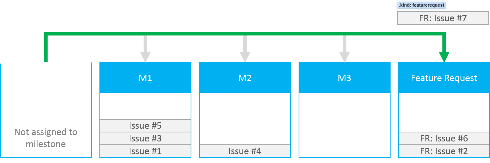
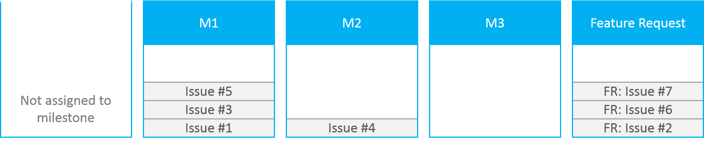
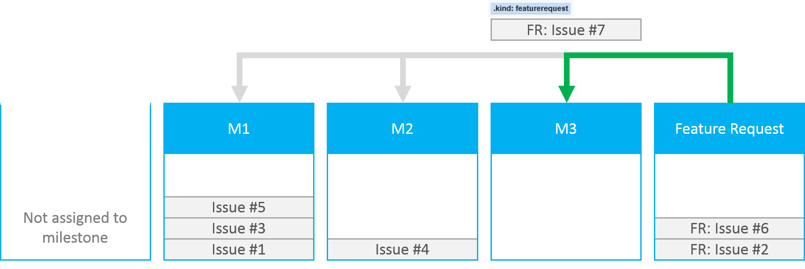

The following outlines how issues, feature requests, and pull requests will be triaged for the WinJS project.

## New Issues
New issues that are submitted to the WinJS project by default will be not be associated with a milestone. The [M1](../issues?milestone=1&state=open), [M2](../issues?milestone=2&state=open), [M3](../issues?milestone=3&state=open), ..., Mn [milestones](../issues/milestones) are the groups of work that are associated with our [roadmap](Roadmap). The [Feature Request milestone](../issues?milestone=4&state=open) are for issues that are really feature requests as opposed to code bugs, test bugs, documentation bugs, or pull requests. Feature Requests are handled slightly different (see [Feature Request section](#feature-requests)).

Issue #7 is submitted to WinJS.

Issue #7 is not associated with a milestone. It is considered untriaged and hasn't been evaluated by the team yet.

## Triage

Triage is a manual process that occurs when the team evaluates issues that are not associated with a milestone.

### Code bugs, Test bugs, Documentation Bugs, etc.

First, the team will determine if the issue can be [resolved](#resolution).

If not, the issue needs more action, the team performs _at least_ the following actions:
* Determines the kind of the issue: code bug, test bug, doc bug, feature request, etc. and applies the respective `kind` label
* Assigns the issue to a contributor to be looked at further
* Assigns the issue to an appropriate [milestone](../issues/milestones) outlined in our [roadmap](Roadmap)

Issue #7 has an assigned kind label, contributor, and milestone.

Issue #7 is assigned to a milestone and is considered to be triaged.

Depending on the milestone that the team is working on, the issue will be further evaluated and other labels will be applied:
* `feature` label determines the feature component affected (e.g. ListView, FlipView, Build processes, etc.)
* `status` label indicates the current status of the issue. If there is no status label associated with an issue, it means that the assignee has not looked at the issue yet

The assignee will work on the issue until it can be closed and [resolved](#resolution). 

The goal is to close and resolve all issues associated with the current working milestone.

At any time,  an assignee can have an issue re-triaged if new information about the issue is discovered and needs a reevaluation by the team. The assignee needs to remove the assigned milestone (making it an issue not assigned to a milestone) and will be reevaluated by the team by the same [triage process](#triage).
 
### Pull Requests
Remember before you submit any pull requests, please read how to [contribute code](../blob/master/CONTRIBUTING.md) to the WinJS project.

Pull requests are mostly treated just like any other issue submitted to the WinJS project. They are assigned to a [milestone](../issues/milestones) outlined by the [roadmap](Roadmap). If they are assigned to the current working milestone they will most likely be merged into the project. However a pull request that is not assigned to the current working milestone can be merged in early if it meets the following criteria:
* The code changes are not essentially a new feature request
* The code changes are relatively small, localized, easily understood, and do not change a significant size of the API surface area
* The code changes deliver clear value and goodness to the overall community or unblock a very common reoccurring issue hit by many in the greater community

Note this is done on a case by case basis. It should be thought of as an exception to the process rather than normal practice.

### Feature Requests
Feature requests are triaged similar to most issues submitted to the WinJS project. However, instead of being assigned to a working milestone, they are first assigned to the [Feature Request milestone](../issues?milestone=4&state=open).

Issue #7 is a feature request and assigned to the Feature Request milestone.

Issue #7 is assigned to the Feature Request milestone and is considered triaged.

After lots of discussion on the feature request, the team will assign the feature request to the appropriate [milestone](../issues/milestones) outlined in our [roadmap](Roadmap) to be worked on.

Issue #7 is assigned to the appropriate working milestone.

Note: This process will be considerably longer than say triaging a code bug, so if the team does not take action on feature requests right away please don't get discouraged. We appreciate feature requests! It lets us know what the community wants to see implemented in the project. Use the [roadmap](Roadmap) get an idea of what the team is working on and when we will start engaging on the feature request.

## Resolution
Resolution is a indication of why an issue was closed.

When an issue is triaged, the team will determine if they can close and resolve it first. If not, they follow the [triage process](#triage) outlined in this document.

When an issue is closed the `resolution` label will be applied to the issue. The following is an explanation of the labels:
* `resolution: accepted` - a pull request was accepted
* `resolution: by design` - the behavior or functionality was designed to behave that way and will not be changed at this time
* `resolution: duplicate` - this issue is a duplicate of another issue previously submitted
* `resolution: external` - the fundamental issue is found deeper in the technology stack and the WinJS project cannot address the issue (e.g. root cause of an issue is found in a browser)
* `resolution: fixed` - the issue was fixed
* `resolution: no repo` - the issue cannot be reproduced at this time
* `resolution: rejected` - the pull request was rejected
* `resolution: wontfix` - the issue will not be fixed at this time