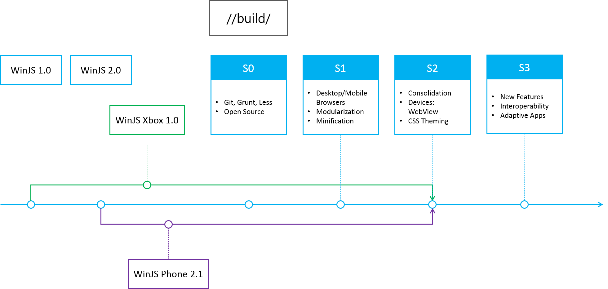

# Outline
The following in this document outlines our roadmap for the Windows Library for JavaScript (WinJS). The team will use this as a planning and framing document for WinJS, not an exact specification or check list of features to come. Our plans can change and we are flexible. We especially value your feedback and want you participate with us as we plan our upcoming releases.

WinJS is a set of JavaScript toolkits that allow developers to build applications using HTML/JS/CSS technology forged with the following principles in mind:
* Provide developers with a distinctive set UI controls with high polish and performance; as well as, fundamental support for touch, mouse, keyboard and accessibility
* Provide developers with a cohesive set of components and utilities to build the scaffolding and infrastructure of their applications

The team will continue to use these guiding principles as we shape the vision for the WinJS project. However, in order to move forward, we believe it’s beneficial to understand how we’ve got here.

# The Past
Not many know, but WinJS was actually born in the browser – and in the beginning, goals were lofty and skies were definitely blue. As the project moved forward, vision became clearer and scenarios became crisper. And like all engineering projects, scope, risk, and resources also shaped the vision of the first release WinJS 1.0 with Windows 8.
Since then, WinJS has been subsequently released three more times:
* WinJS 2.0 with Windows 8.1
* WinJS Xbox 1.0 with Xbox One
* WinJS Phone 2.1 with Windows Phone 8.1

From these releases, the team has gathered important feedback from developers who use WinJS for building their applications; as well as, truly understanding just how much developers push and bend API’s to the extreme. This battle testing was a necessity for measuring and evaluating the reliability of the features of WinJS. Also with shipping multiple releases, the team was able to grasp and understand the full impacts of performance, compatibility, and migration for developers moving their applications forward. 

The team will be applying all the lessons learned from our previous releases as we move forward with WinJS.

# The Present
At the time of this writing, the number one feature request for WinJS is being able to run it cross-platform and in the browser. The team believes that WinJS should be compatible with the tools, libraries, and solutions that many web developers use and love today. So here are just some of things the team has been working on to achieve this:
* The WinJS project is now open source and hosted on GitHub
* The WinJS build infrastructure has been moved over to use [GruntJS](http://gruntjs.com/)
* CSS files are now being generated with [Less](http://lesscss.org/)
* Unit tests are runnable using [QUnit](http://qunitjs.com/)

This has been quite an undertaking for the team and we’re excited to share our progress. Not only has our team being working on the internals of the project, we very excited to show the current cross-platform browser support at [http://try.buildwinjs.com](http://try.buildwinjs.com/).

Our team is thrilled that we are bringing WinJS back to its browser roots and excited to see where the web takes us.

# The Future
This next section outlines the areas of investments for the next release of WinJS. The team likes to think in groups of three and our investments will be grouped around the short term, near term, and long term. We will identify each group with the letter “S.” This can stand for: stage, scenario, sprint, etc. We’ll use the term sprint. Sprints don’t necessarily have specific time frame associated with them just yet, but as we iterate we will strive for consistent cadence. Our goal for each sprint is to have a set of features that are of high quality that can be reliably used in your application.

## S1 – Base Infrastructure, Browser Support, and Web Readiness
The main theme of this sprint is to get our fundamental code base in shape and ready to use in web scenarios. This includes but is not limited to the following:

### Base Infrastructure
Complete any necessary internal tool migrations to have WinJS working on web tools

### Desktop and Mobile Browser Support
Ensure that WinJS can run reliably in Desktop and Mobile Browsers. This includes both Single Page App (SPA) utilities and UI controls. Rationalize our UI controls and UX in the web context. Provide a graded matrix for Desktop and Mobile browsers.

### Modularization
Allow developers to load in components of WinJS, rather than having to include every component.

### Minification
Provide optimized minified versions of WinJS for web deployment.

## S2 – Finish Browser & Web Readiness, Consolidation, and Devices
The main theme of this sprint is to finish and polish work around browsers from S1, consolidating the versions of WinJS that already exist, and focusing on WinJS uses on devices. This includes but is not limited to the following:

### Finish Desktop and Mobile Browser Support
Complete any work necessary to fill out our graded browser support.

### CSS Theming
Refactor our CSS to allow developer more flexibility in theming their UI.

### Consolidation
Consolidate the functionality between WinJS 2.0, WinJS 2.1, and WinJS 1.0 Xbox into one main version. Reconcile UX across these versions.

### Devices: WebView
Focus on hosting WinJS in WebView environments like Apache Cordova

## S3 – New Features, Interoperability, and Adaptive Apps
The main theme of this sprint is to work on new features for WinJS and interoperability with other popular JavaScript libraries. This includes but is not limited to the following:

### New Features
SPA utilities and new UI controls 

### Interoperability
Build interoperability utilities to work with other popular JS libraries.

### Adaptive Apps
SPA utilities and possibly UI controls that helps developers span their UX across device types and platforms

## Watch List
The team knows technology changes very fast in the HTML/JS/CSS space. With that, there are sets of technologies that we are watching and staying educated on.

We see the value that they bring and how WinJS could be used with them; however, we may not have the time or resources available to get to every interesting piece of technology. We are definitely interested and we just want you to know they are also on our mind:
* TypeScript 
* Apache Cordova
* Web Components
* ECMAScript 6

# Feedback
We also appreciate and invite you to give feedback and ideas for future development. So please participate with us as we plan our upcoming releases.